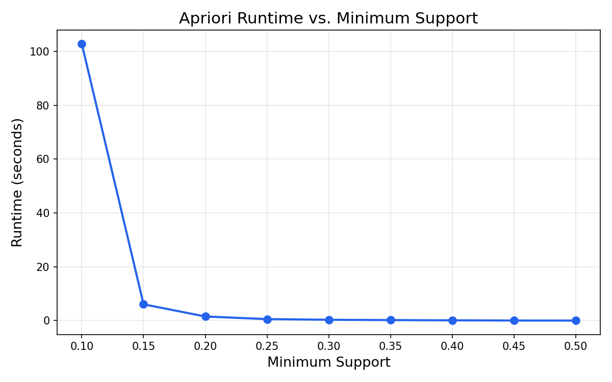
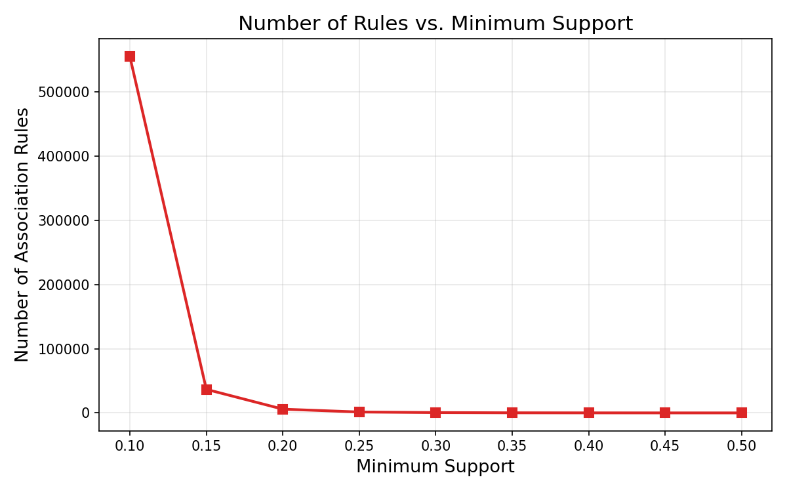

# Apriori Algorithm — Report

## Part 1: Implementation

We implemented the Apriori algorithm in Python to find frequent itemsets and generate association rules.

The algorithm works as follows:
1. Scan all transactions to find items that appear frequently (meet minimum support)
2. Combine frequent items into pairs, then triples, and so on
3. At each step, prune candidates that contain an infrequent subset
4. From the frequent itemsets, generate rules where confidence ≥ min_confidence

### Test Output

We verified our implementation on the provided test file (5 transactions, 6 items) with min_support = 0.6 and min_confidence = 0.7. The results match the expected reference output (28 rules, L(1)=6, L(2)=8, L(3)=2).

### ANES Dataset Output

We ran the algorithm on the ANES dataset (anes_apriori.arff — 2,713 transactions, 82 attributes) with min_support = 0.85 and min_confidence = 0.7 to match Weka's default settings.

Frequent itemsets found:
- L(1): 10 itemsets
- L(2): 14 itemsets
- L(3): 8 itemsets
- L(4): 1 itemset

Top rules (confidence = 1.0):
- reg_Yes=1 ⟹ reg_No=0 (support: 0.96)
- follow_Closely=1 ⟹ follow_NotClosely=0 (support: 0.89)
- diversity7_High=0 reg_Yes=1 ⟹ reg_No=0 (support: 0.89)

Total: 90 rules generated. These results closely match Weka's output on the same dataset.

---

## Part 2: Runtime and Rules vs. Minimum Support

We ran the algorithm on the ANES dataset (2,713 transactions, 82 attributes) with min_confidence = 0.7 and swept min_support from 0.10 to 0.50.

Both runtime and number of rules increase exponentially as minimum support decreases. Lower support means more frequent itemsets pass the threshold, leading to more candidates and more rules. At sup=0.50 the algorithm finishes almost instantly with a handful of rules, while at sup=0.10 it takes about 103 seconds and produces over 555,000 rules.
